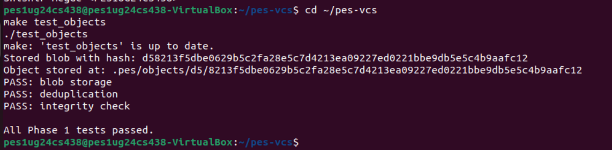
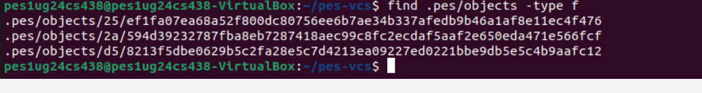
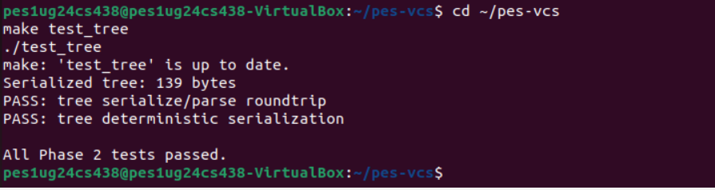
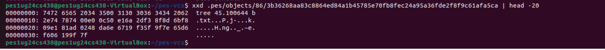
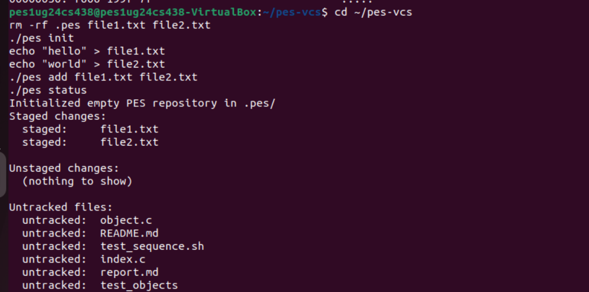
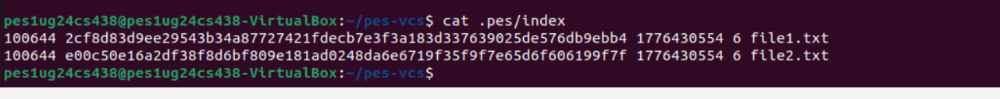
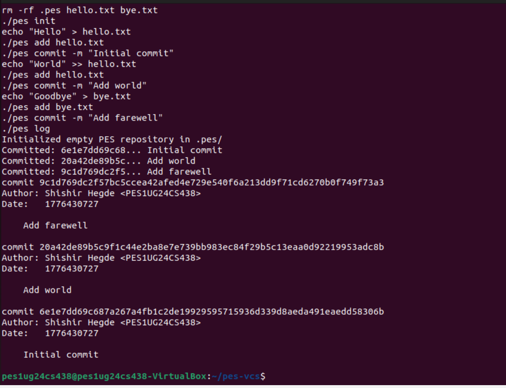
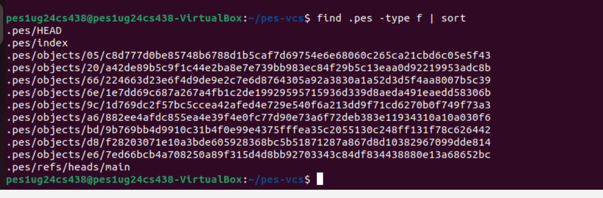
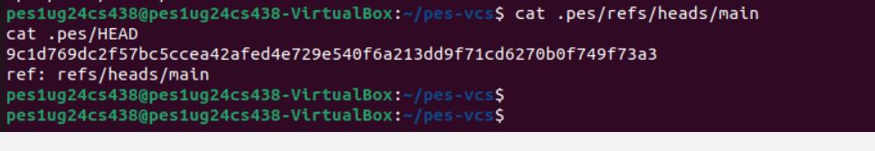
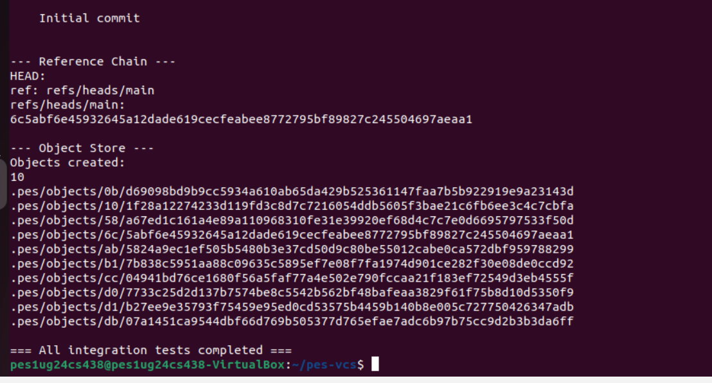

# PES-VCS Lab Report

**Name:** Shishir Hegde  
**SRN:** PES1UG24CS438  
**Repository:** https://github.com/Shishir-Hegde14/PES1UG24CS438-pes-vcs  
**Platform:** Ubuntu 22.04 (WSL)

---

## Phase 1

### Screenshot 1A - `./test_objects` output

### Screenshot 1B - `find .pes/objects -type f`

---

## Phase 2

### Screenshot 2A - `./test_tree` output

### Screenshot 2B - Raw tree object (`xxd ... | head -20`)

---

## Phase 3

### Screenshot 3A - `pes init` -> `pes add` -> `pes status`

### Screenshot 3B - `cat .pes/index`

---

## Phase 4

### Screenshot 4A - `pes log` with three commits

### Screenshot 4B - `find .pes -type f | sort`

### Screenshot 4C - `cat .pes/refs/heads/main` and `cat .pes/HEAD`

---

## Final Integration Test

### `make test-integration`

---

## Phase 5 & 6 Analysis Answers

### Q5.1
A branch is a ref file in `.pes/refs/heads/<branch>`, and `HEAD` usually stores `ref: refs/heads/<branch>`.  
To implement `pes checkout <branch>`:

1. Verify branch file exists and read its commit hash.
2. Resolve the target commit -> root tree.
3. Compare current working state with index/HEAD to detect conflicts.
4. If safe, rewrite working directory to match target tree:
   - Create needed directories.
   - Write tracked files from blob objects.
   - Remove tracked files/dirs that no longer exist in target tree.
5. Rewrite `.pes/index` to match the checked-out tree metadata.
6. Update `.pes/HEAD` to `ref: refs/heads/<branch>`.

Complexity comes from filesystem synchronization and safety:
- Preserving uncommitted user changes.
- Handling delete/modify conflicts.
- Recursive directory updates.
- Keeping `HEAD`, refs, index, and working tree atomically consistent.

### Q5.2
Conflict detection for dirty checkout can be done with index + object store:

1. For each tracked path in index:
   - `stat` current working file.
   - If file missing -> candidate dirty/deleted.
   - If `mtime/size` differ, re-hash file contents and compare with indexed blob hash.
2. If working content differs from index, file is dirty.
3. Compute target branch snapshot membership for each path:
   - If dirty file is also different between current HEAD tree and target tree, it is a checkout conflict.
4. Refuse checkout when any such conflict exists.

This mirrors Git's "would be overwritten by checkout" protection.

### Q5.3
Detached HEAD means `HEAD` points directly to a commit hash instead of a branch ref.  
New commits are created normally, but no branch pointer moves, so those commits can become unreachable later.

Recovery methods:
1. Immediately create a branch at current commit:  
   `git branch rescue-branch <detached-commit>`
2. If already moved away, find commit via reflog-like history (in Git: `git reflog`) and create a branch from that hash.

In PES-style systems, equivalent recovery is creating/updating a ref file to that commit hash before GC removes unreachable objects.

### Q6.1
Use mark-and-sweep GC:

1. **Mark roots**: all commits referenced by `.pes/refs/heads/*` (and optionally HEAD if detached).
2. **Traverse reachable graph**:
   - From each commit: mark commit object, then follow `parent` and `tree`.
   - From each tree: mark tree object, then recursively follow subtree/tree entries and blob hashes.
3. Store marked hashes in a hash set for O(1) membership checks.
4. **Sweep** `.pes/objects/*/*`:
   - If object hash not in reachable set, delete it.

For 100,000 commits and 50 branches:
- Commit visits are near the unique commit count, not 50 x 100,000, because branches usually share history.
- Reachable total object visits are approximately: commits + trees + blobs reachable from branch tips.
- In a typical repository this can be several hundred thousand to a few million objects, but traversal remains linear in reachable object count.

### Q6.2
Concurrent GC with commit creation is dangerous due races:

1. Commit process writes new blob/tree objects and is about to write commit/ref.
2. GC scans refs before the new commit is referenced.
3. Newly written objects appear unreachable to GC and get deleted.
4. Commit then writes a ref pointing to objects that no longer exist -> repository corruption.

How real Git avoids this:
- Uses lock files/coordination to avoid unsafe overlap.
- Keeps recently created objects protected (mtime grace periods, quarantine, or pack safety rules).
- Performs reference updates atomically.
- Runs GC in ways that do not delete objects that may still be in-flight.

